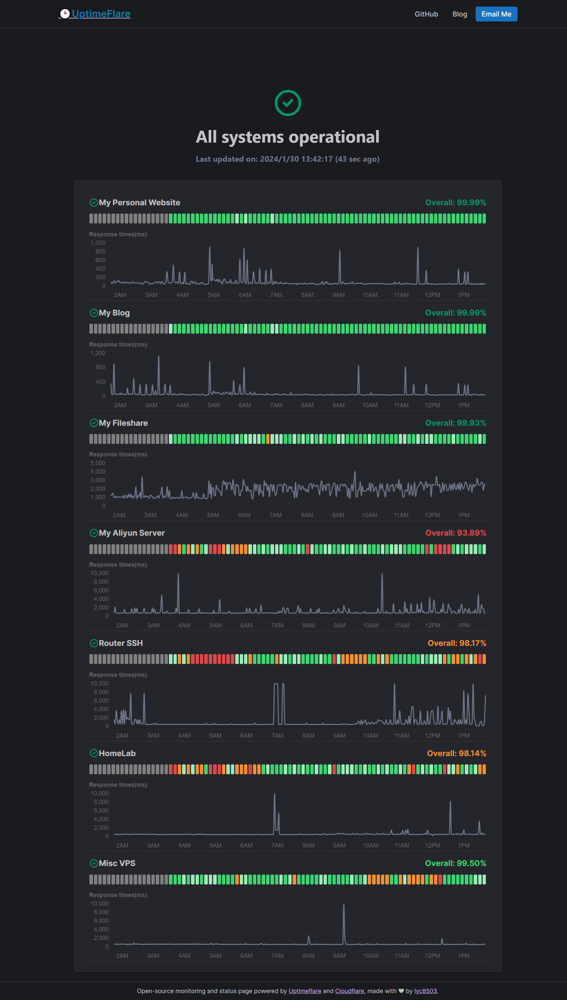

# ✔ [UptimeFlare](https://github.com/lyc8503/UptimeFlare)

A more advanced, serverless, and free uptime monitoring & status page solution, powered by Cloudflare Workers, complete with a user-friendly interface.

# UptimeFlare Status Page

A modern, serverless uptime monitoring and status page solution, powered by Cloudflare Workers. This project uses the [UptimeFlare](https://github.com/lyc8503/UptimeFlare) template for easy deployment and advanced monitoring features.

## 🌐 My Status Page

Check the live status page here: [https://uptime.minhtanit.com](https://uptime.minhtanit.com)

## 🚀 Features (via UptimeFlare)

- Free, open-source, and easy to deploy (no local tools required)
- Monitor up to 50 endpoints at 1-minute intervals
- Geo-specific checks from 310+ cities worldwide
- HTTP/HTTPS/TCP port monitoring
- 90-day uptime history and percentage tracking
- Custom request methods, headers, and body for HTTP(s)
- Custom status code & keyword checks
- Downtime notifications via [100+ channels](https://github.com/caronc/apprise/wiki)
- Customizable Webhook support
- Interactive response time charts
- Responsive, theme-adaptive UI
- Customizable status page and domain (CNAME support)
- Optional password protection
- JSON API for real-time status data

## 📦 Template & Upstream

This project is based on the official [UptimeFlare template](https://github.com/lyc8503/UptimeFlare). For setup instructions, advanced configuration, and documentation, see the [UptimeFlare Wiki](https://github.com/lyc8503/UptimeFlare/wiki).

## 🖼️ Screenshots

## 📝 License

See [LICENSE](LICENSE) for details.
